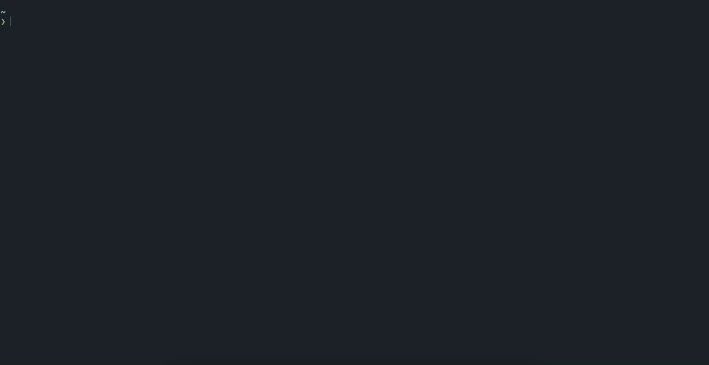

<p align="center">
  
</p>
<p align="center" style="font-size: 1.2rem;">a sleek typing tui written in rust</p>
<hr >

[](.github/LICENSE.md)
[](https://github.com/coloradocolby/thokr/actions/workflows/build.yml)
[](https://github.com/coloradocolby/thokr/actions/workflows/docker.yml)
[](https://github.com/coloradocolby/thokr/issues)



## Installation

### Cargo

```sh
$ cargo install thokr
```

### Docker

```sh
$ docker run -it coloradocolby/thokr
```

## Arch Linux

On Arch Linux, you can install it from AUR:

``` sh
paru -S thokr-git
```


## Usage

For detailed usage run `thokr -h`.

### Examples

| command                     |                                                    test contents |
| :-------------------------- | ---------------------------------------------------------------: |
| `thokr`                     |                          50 of the 200 most common english words |
| `thokr -w 100`              |                         100 of the 200 most common English words |
| `thokr -w 100 -l english1k` |                        100 of the 1000 most common English words |
| `thokr -w 10 -s 5`          | 10 of the 200 most common English words (hard stop at 5 seconds) |
| `thokr -p "$(cat foo.txt)"` |                 a custom prompt with the output of `cat foo.txt` |

## Supported Languages

The following languages are available by default:

| name         |                     description |
| :----------- | ------------------------------: |
| `english`    |   200 most common English words |
| `english1k`  |  1000 most common English words |
| `english10k` | 10000 most common English words |

## Roadmap

- [ ] ⚡️ Performance
  - Right now there are known performance issues surrounding the rendering of
    the tui at each tick interval and/or key press. Ideally each render could
    use the last render to make only minor adjustments (possibly using
    [StatefulWidget](https://docs.rs/tui/0.10.0/tui/widgets/trait.StatefulWidget.html),
    but I haven't been able to figure that out yet.
- [ ] 🔠 Multi-language support
  - I decided not to launch thokr with languages besides english because of some
    odd rendering issues I was experiencing when trying to input characters with
    accents. It's as though I'm not able to properly input the character in [raw
    mode](https://docs.rs/crossterm/0.3.0/crossterm/raw/index.html). I'd love to
    have that figure out before shipping other languages because I personally
    felt the experience was a bit jarring. I'll open an bug report for it with
    more details and replication steps -- would love more eyes on that problem!
- [ ] 🧪 Tests
  - I've only written a small amount of tests at this point. I haven't sat down
    to really think through what tests look like when the output is dependent on
    the users terminal size, font size, etc. If you have any ideas for this please
    open up an issue and start the discussion!

## Contributing

All contributions are **greatly appreciated**.

If you have a suggestion that would make thokr better, please fork the repo and
create a [pull request](https://github.com/coloradocolby/thokr/pulls). You can
also simply open an issue and select `Feature Request`

1. Fork the repo
2. Create your feature branch (`git checkout -b feature/xyz`)
3. Commit your changes (`git commit -m 'Add some xyz'`)
4. Rebase off main (`git fetch --all && git rebase origin/main`)
5. Push to your branch (`git push origin feature/xyz`)
6. Fill out pull request template

See the [open issues](https://github.com/coloradocolby/thokr/issues) for a full
list of proposed features (and known issues).

## License

Distributed under the MIT License. See [LICENSE.md](.github/LICENSE.md) for more information.

## Acknowledgments

Check out these amazing projects that inspired thokr!

- [monkeytype](https://github.com/Miodec/monkeytype)
- [tui-rs](https://github.com/fdehau/tui-rs)
- [ttyper](https://github.com/max-niederman/ttyper)

## Follow

[](https://github.com/coloradocolby)

[](https://twitter.com/coloradocolby)

[](https://youtube.com/user/coloradocolby)
